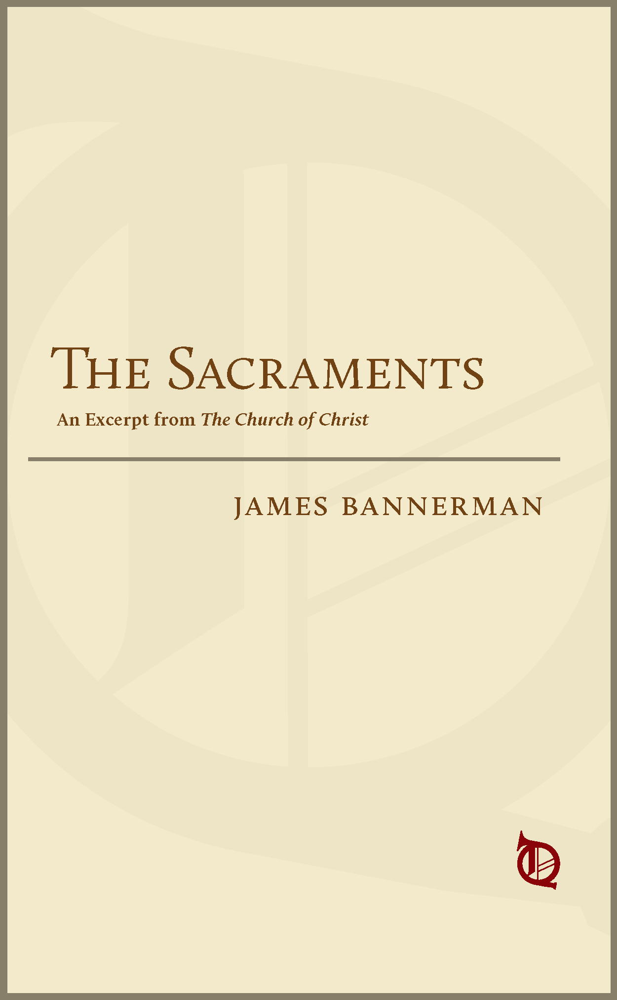

--- 
title: "The Sacraments"
author: "James Bannerman"
date: "1868"
description: "Nobody gets the Church like Bannerman, and this treatise on the Sacraments is mandatory reading today."
params:
  project: "bannerman-sacraments"
  scans: "https://archive.org/details/churchofchristtr02bann/page/n11/mode/2up"
site: bookdown::bookdown_site
always_allow_html: yes
documentclass: book
cover-image: "cover.png"
url: "https://warhornmedia.github.io/bannerman-sacraments"
---

```{r, include=FALSE} 
if (!dir.exists("classics-template-files")) {
download.file(url="https://github.com/warhornmedia/classics-template-files/archive/master.zip", destfile = "classics-template-files.zip")
unzip(zipfile = "classics-template-files.zip", overwrite = TRUE)
file.remove("classics-template-files.zip")
file.rename("classics-template-files-master", "classics-template-files")
}
```

```{r, child='classics-template-files/rmds/classics-cover-page.Rmd'}
```


#### Cover {-}

